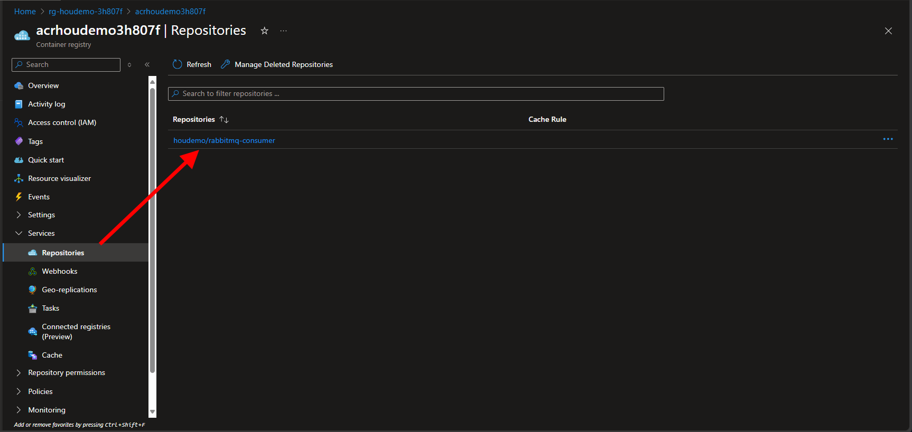

# Demo

This repo contains the artifacts used for a demo to the Houston .NET User Group on 10 April 2025. The demo illustrates how to use KEDA and Karpenter to autoscale a .NET Core application running in Kubernetes. The demo is based on the [KEDA documentation](https://keda.sh/docs/latest/examples/azure-sql/) and the [Karpenter documentation](https://karpenter.sh/docs/getting-started/).

## Prerequisites

To run this the demo, you will need to have access to an active Azure subscription with privileges to create reosurces and assign roles. You will also need to have the following tools installed on your local machine:

- [.NET 9 SDK and runtime](https://dotnet.microsoft.com/en-us/download/dotnet/9.0)
- [Azure CLI](https://docs.microsoft.com/en-us/cli/azure/install-azure-cli)
- [kubectl](https://kubernetes.io/docs/tasks/tools/)
- [Helm](https://helm.sh/docs/intro/install/)

## Create the infrastructure

To create the infrastructure for the demo, a script, `deploy.sh` has been provided in the `infra` folder. The script will create the following resources in Azure:

- An Azure Resource Group
- An Azure Kubernetes Service (AKS) cluster
- An Azure Container Registry (ACR)

The script will also:

- Configure the AKS cluster to use the ACR for pulling images
- Create Karpenter node pool on the AKS cluster
- Deploy a RabbitMQ instance on the AKS cluster

## Build the applications

In the app folder, you will find two .NET Core applications:

- `Publisher`: A console application that sends messages to a RabbitMQ queue.
- `Consumer`: A console application that consumes messages from the RabbitMQ queue.

The applications are built using .NET 9 and use the `RabbitMQ.Client` NuGet package to interact with RabbitMQ.

Both applications are initialized from three environment variables:

- `RABBITMQ_HOST`: The hostname of the RabbitMQ instance.
- `RABBITMQ_USERNAME`: The username to use to connect to RabbitMQ.
- `RABBITMQ_PASSWORD`: The password to use to connect to RabbitMQ.

### Testing the applications locally

You can test the application code locally using tools like Docker Desktop, Docker Compose or Podman to run RabbitMQ on your local machine. Here is an example of how to do this using podman:

```bash
podman run -d --name rabbitmq -e RABBITMQ_DEFAULT_USER=$RABBITMQ_USERNAME -e RABBITMQ_DEFAULT_PASS=$RABBITMQ_PASSWORD -p 5672:5672 -p 15672:15672 rabbitmq:4-management
```

This will start a RabbitMQ instance with the management plugin enabled. You can access the management interface at `http://localhost:15672` using the username and password you provided in the environment variables.

Once you have RabbitMQ running locally, you can build and run the applications by opening two terminal windows and navigating to the `app/Consumer` and `app/Publisher` folders, respectively. In each terminal window, run the following command:

```bash
dotnet run
```

This will start the application and connect to the RabbitMQ instance running locally. The publisher will send messages to the queue, and the consumer will consume them. Both applications log their activity to the console. The publisher app will send a fixed number of messages to the `orders-task` queue on the RabbitMQ broker, then prompt the user to press Enter to exit. The consumer app will consume messages from the `orders-task` queue and log them to the console. The consumer app will run continue to listen for messages  until you stop it by pressing Ctrl+C in the terminal window.

## Containerizing the Consumer application

Once you have verified the application code is working locally

For this demo, we will be using the `Consumer` application as a containerized application running in Kubernetes. The `Publisher` application will be run locally to send messages to the RabbitMQ queue.

To containerize the `Consumer` application, we will use a Dockerfile to build a Docker image. The Dockerfile is located in the `app/Consumer` folder. For the demo, not only do we need to build the image, but we also need to push it to the Azure Container Registry (ACR) that we created after running the `deploy.sh` script.

The script `docker-command.sh` has been provided in the `app` directory to build the Docker immage and push it to the ACR. Before running the script, you must:

- Be logged in to Azure using the Azure CLI. You can do this by running the following command:

```bash
az login
```

- Set the `ACR_NAME` environment variable to the name of the ACR that was created by the `deploy.sh` script. You can do this by running the following command:

```bash
export ACR_NAME=<your-acr-name>
```

- Run the script from the root directory of the repo. Use the following command to run the script:

```bash
chmod +x ./app/docker-command.sh
./app/docker-command.sh
```

This will build the Docker image for the `Consumer` application and push it to the ACR. The image will be tagged with the name of the ACR. When the script completes, you should see the image in the ACR.



## Deploying the Consumer application to AKS

There are two manifests in the `keda` directory that are used to deploy the `Consumer` application to AKS. In order to deploy the application to the AKS cluster created when you ran the `deploy.sh` script, you will need to run the following commands to get the AKS credentials and set the context to the AKS cluster:

```bash
az aks get-credentials --resource-group <your-resource-group-name> --name <your-aks-cluster-name>
```

Once you have the AKS credentials, you need to create a secret in the AKS cluster to store the RabbitMQ credentials. You can do this by running the following command:

```bash
kubectl create secret generic rabbitcreds --from-literal=username=$RABBITMQ_USERNAME --from-literal=password=$RABBITMQ_PASSWORD
```

After creating the secret, you can deploy the `Consumer` application to the AKS cluster by running the following command:

```bash
kubectl apply -f keda/demo-consumer.yaml
```

Next, you will need to deploy the KEDA ScaledObject that will be used to scale the `Consumer` application based on the number of messages in the RabbitMQ queue. You can do this by running the following command:

```bash
kubectl apply -f keda/keda-scaled-object.yaml
```

This will create a KEDA ScaledObject that will monitor the `orders-task` queue in RabbitMQ and scale the `Consumer` application based on the number of messages in the queue. The `Consumer` application will be scaled up to a maximum of 10 replicas when there are more than 20 messages in the queue.

You can test this by opening multiple terminal windows and running the `Publisher` application in each window with the RABBITMQ_HOSTNAME variable set to the IP address of the service associated with the RabbitMQ deployment on your AKS cluster.  You can find the IP address by running the following command:

```bash
kubectl get service -n $APP_NS
```

where the environment variable `APP_NS` is set to the namespace where the RabbitMQ and the Consumer app deployment are running. The output from the command should look like this (where X.X.X.X is the public IP address of the RabbitMQ service):

```text
kubectl get service -n houdemo
NAME       TYPE           CLUSTER-IP     EXTERNAL-IP   PORT(S)                          AGE
rabbitmq   LoadBalancer   10.0.250.103   X.X.X.X       5672:30168/TCP,15672:31907/TCP   3d22h
```

## Autoscaling the Consumer application

Copy the public IP address and set the `RABBITMQ_HOSTNAME` environment variable in the terminal window where you are running the `Publisher` application. You can do this by running the following command:

```bash
export RABBITMQ_HOSTNAME=<your-rabbitmq-ip-address>
```

then run the `Publisher` application in each terminal window.

### Log into RabbitMQ to observe the queue depth

Log into the RabbitMQ broker using the public IP address of the RabbitMQ service and the management port (15672). You can do this by opening a web browser and navigating to `http://<your-rabbitmq-ip-address>:15672`. Use the username and password you provided in the environment variables to log in. Once you are logged in, you should see the `orders-task` queue and its depth.

## Observing KEDA and Karpenter in action

You can use the [K9s](https://k9scli.io/) CLI to observe the KEDA and Karpenter components in action. K9s is a terminal-based UI for managing Kubernetes clusters. Once you have K9s installed, open two terminal windows to run k9s. Set the namespace in each window to the namespace of your Consumer application and RabbitMQ deployment. Then, in the first window enter the command to observe pods, and in the second window enter the command to observe the nodes on the cluster. As the queue depth increases, you should see KEDA scaling the `Consumer` application up and down based on the number of messages in the queue. You should also see Karpenter creating and deleting nodes in the AKS cluster as needed to support the scaling of the `Consumer` application.

## Cleanup

Once you have finished the demo, you can clean up the resources created in Azure by running the following command:

```bash
az group delete --name <your-resource-group-name> --yes --no-wait
```

This will delete the resource group and all the resources created in it, including the AKS cluster, ACR, and RabbitMQ instance.

## Conclusion

This demo illustrated how to use KEDA and Karpenter to autoscale a .NET Core application running in Kubernetes. The demo used a RabbitMQ instance as the message broker and showed how to deploy the application to AKS using KEDA and Karpenter. The demo also showed how to monitor the queue depth and observe the scaling of the application in action using K9s.
